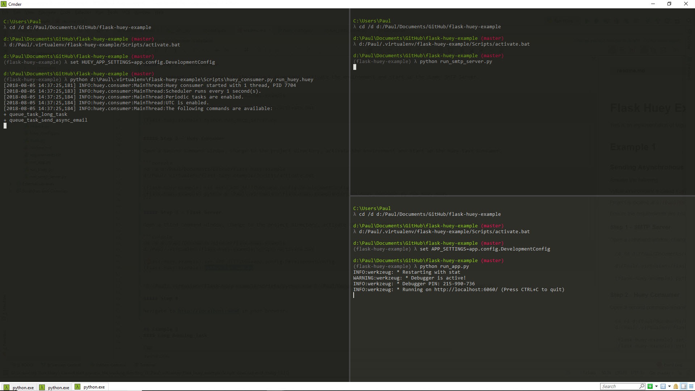
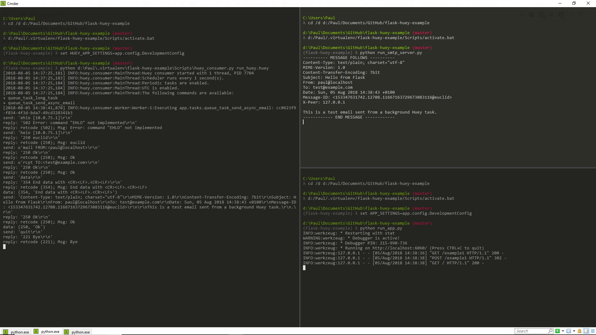

# Flask Huey Example 

This is an implementation of Miguel Grinberg's article [Using Celery With Flask](https://blog.miguelgrinberg.com/post/using-celery-with-flask) with [Huey](https://huey.readthedocs.io/en/latest/index.html) replacing Celery.

## Example 1
#### Sending Asynchronous Emails

Assume the following:

Virtual environment is called `flask-huey-example` and is located at `d:/Paul/.virtualenv/flask-huey-example`

Project is located at `D:/Paul/Documents/GitHub/flask-huey-example`

Ensure the requirements are install into the virtual environment.

##### Step 1 - SMTP Server

Open a command window, change to the project directory, activate the environment and start up the dummy SMTP Server.

```console
cd /d d:/Paul/Documents/GitHub/flask-huey-example

d:/Paul/.virtualenv/flask-huey-example/Scripts/activate.bat

(flask-huey-example) python run_smtp_server.py
```

##### Step 2 - Huey Consumer

Open a second command window, change to the project directory, activate the environment and start up the Huey task consumer.

```console
cd /d d:/Paul/Documents/GitHub/flask-huey-example
d:/Paul/.virtualenv/flask-huey-example/Scripts/activate.bat

(flask-huey-example) set HUEY_APP_SETTINGS=app.config.DevelopmentConfig
(flask-huey-example) python d:\Paul\.virtualenv\flask-huey-example\Scripts\huey_consumer.py run_huey.huey
```

##### Step 3 - Flask Server

Open a third command window, change to the project directory, activate the environment and start up the Flask server.

```console
cd /d d:/Paul/Documents/GitHub/flask-huey-example
d:/Paul/.virtualenv/flask-huey-example/Scripts/activate.bat

(flask-huey-example) set APP_SETTINGS=app.config.DevelopmentConfig
(flask-huey-example) python run_app.py
```



##### Step 4

Navigate to http://localhost:6060 in your browser, click link to Example 1 and then click send button.




## Example 2
#### Long Running Task

TBD


## Run Flask
```run_app.py```

## Run Huey Consumer

```huey_consumer.py app_huey.huey```

## Run SMTP Server
```run_smtp_server.py```

